# Stop Cri Studio — User Manual

Stop Cri Studio is an offline OpenAPI 3.0 editor that runs entirely in your browser. You can create, import, edit, persist, and export OpenAPI specifications without any backend or account. Every change is saved automatically to local storage. This manual walks through every feature with screenshots taken from the running application.

## Table of contents

1. [Getting started — the Welcome page](#1-getting-started--the-welcome-page)
2. [Loading saved specifications](#2-loading-saved-specifications)
3. [Importing a YAML or JSON file](#3-importing-a-yaml-or-json-file)
4. [The editor at a glance](#4-the-editor-at-a-glance)
5. [Editing API information](#5-editing-api-information)
6. [Working with paths](#6-working-with-paths)
7. [Path parameters](#7-path-parameters)
8. [Working with operations (HTTP methods)](#8-working-with-operations-http-methods)
9. [Query parameters](#9-query-parameters)
10. [Request body](#10-request-body)
11. [Responses](#11-responses)
12. [Security requirements](#12-security-requirements)
13. [Reusable schemas (`components.schemas`)](#13-reusable-schemas-componentsschemas)
14. [Sidebar navigation, filtering and ordering](#14-sidebar-navigation-filtering-and-ordering)
15. [Autosave and persistence](#15-autosave-and-persistence)
16. [Exporting your specification](#16-exporting-your-specification)

---

## 1. Getting started — the Welcome page

When you open Stop Cri Studio you land on the Welcome page. From here you have three primary entry points:

- **Create** — start a brand new specification with sensible defaults.
- **Load** — reopen a specification you previously saved in this browser.
- **Import File** — load a YAML or JSON OpenAPI 3.0 file from disk.

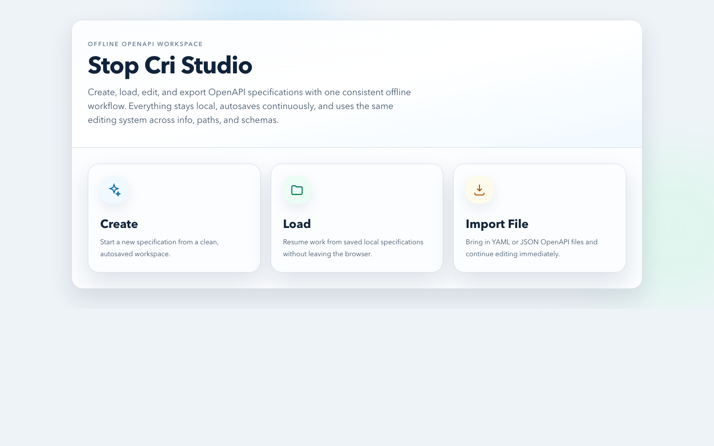

Click **Create** to begin a fresh document. A new specification named "Untitled API" is created and stored automatically; you can rename it at any time from the editor.

## 2. Loading saved specifications

All specifications you create or import are stored in your browser's local storage and are listed inside a modal. If no specifications exist, an empty-state message is shown.

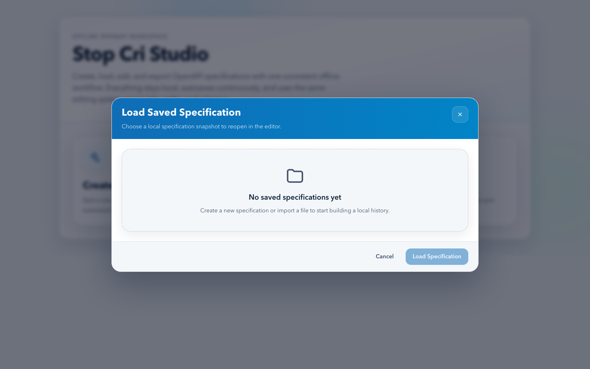

When specifications exist, the modal shows one card per specification with its name, version, and timestamps. Each card has:

- A **Load Specification** button to open it in the editor.
- A **Delete** button (with confirmation) to remove it permanently.

## 3. Importing a YAML or JSON file

Use **Import File** on the Welcome page to pick a `.yaml`, `.yml`, or `.json` file from disk. The file is validated against the OpenAPI 3.0 structure:

- Invalid file types are rejected with a clear error message ("Please select a YAML (.yaml, .yml) or JSON (.json) file.").
- Invalid OpenAPI content displays a list of validation errors and offers a "Try Another File" action.

On success, the imported specification is saved to local storage and opened directly in the editor.

## 4. The editor at a glance

After creating, loading, or importing, you enter the three-pane editor:

- **Header** — specification name, version badge, save status badge, and the **Export YAML** action.
- **Left sidebar** — filter input plus collapsible sections for **Paths** and **Schemas**.
- **Main panel** — content of whatever you selected (Info, Paths, or Schemas).

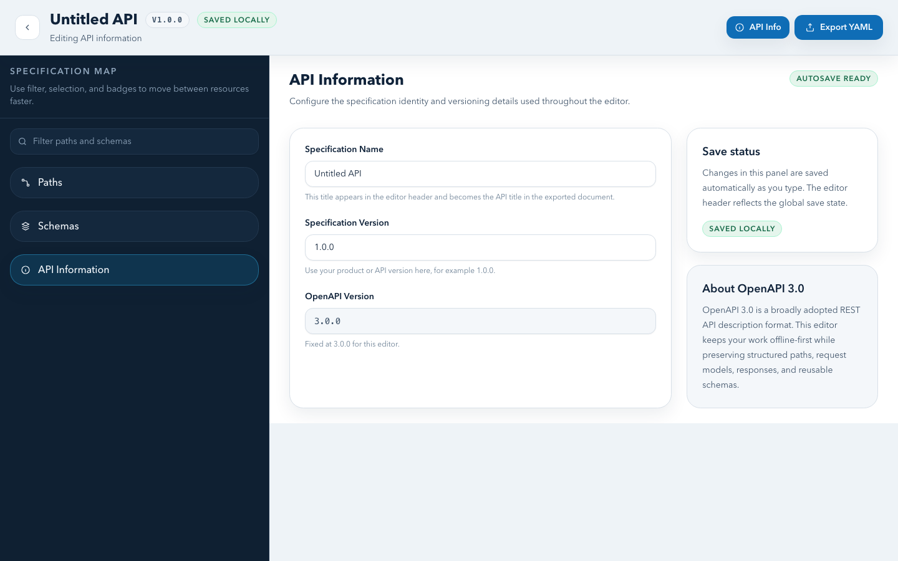

The save status badge in the header switches between **Saving** and **Saved locally** so you always know whether your latest change has been persisted.

## 5. Editing API information

The **API Info** panel maps to the OpenAPI `info` block. You can edit:

- **Specification Name** — appears in the header and as the API title in the exported document.
- **Specification Version** — your API/product version (for example `1.0.0`).
- **OpenAPI Version** — fixed at `3.0.0`.

Click any field, type your changes, and they are autosaved.

## 6. Working with paths

Open the **Paths** section in the sidebar to see all defined endpoints. When the list is empty, an empty state explains how to add the first path.

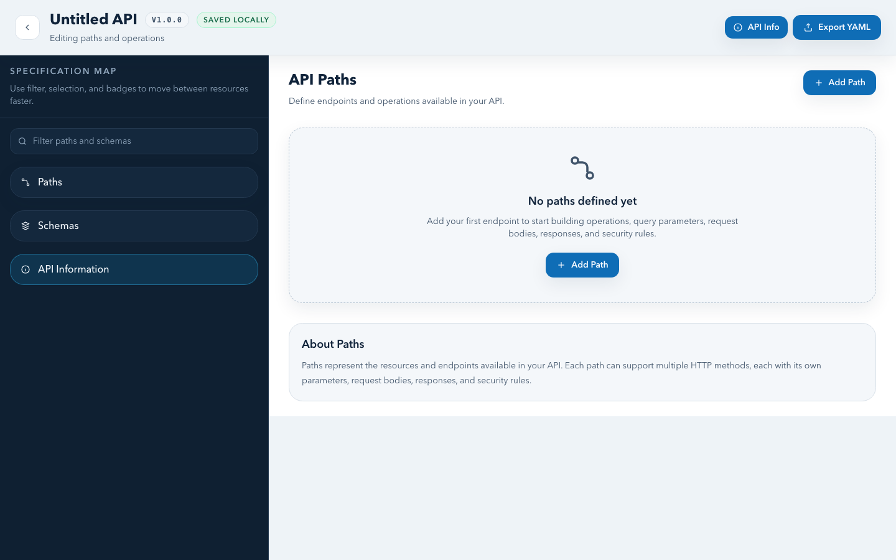

### Add a new path

Click **Add Path**. The list is replaced by a focused form where you type the path string (for example `/users` or `/users/{id}`).

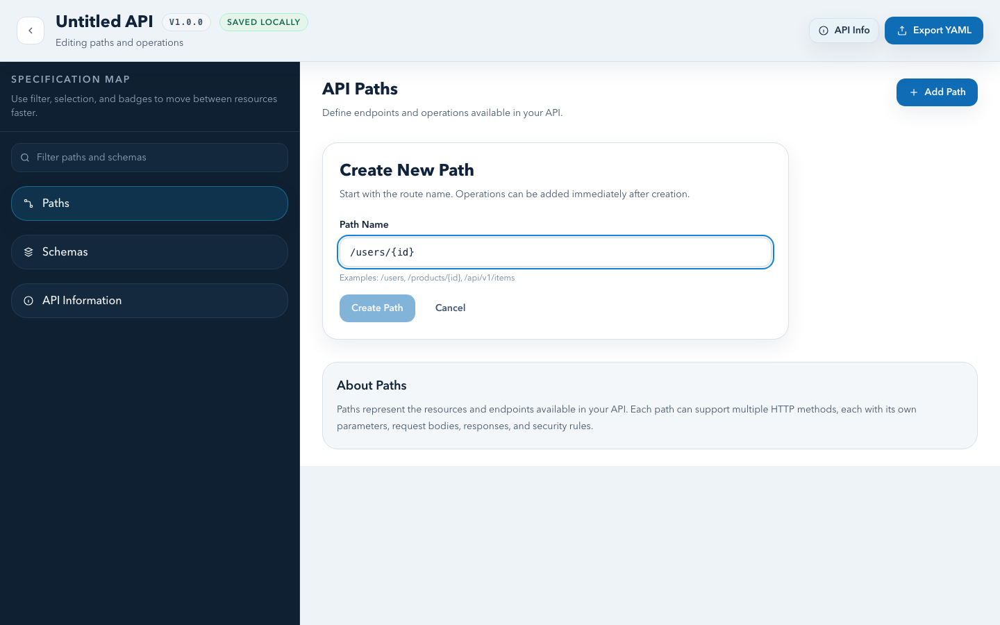

After clicking **Create Path**, the new path is auto-selected and the **Path Workflow** form opens with all HTTP methods displayed as interactive buttons.

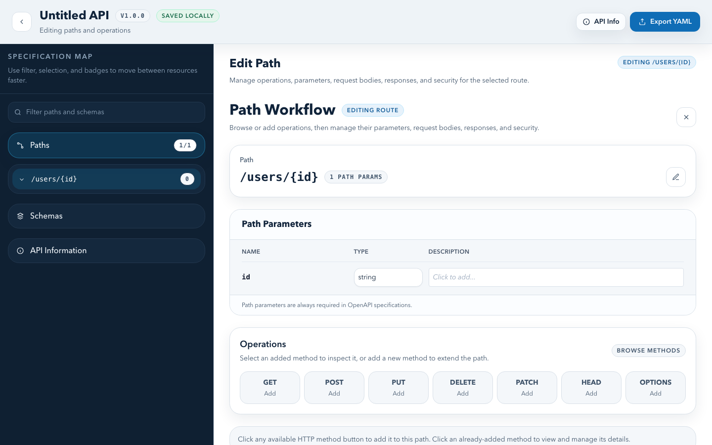

### Rename or delete a path

- A pencil icon next to the path name in the form header lets you rename a path inline. Renaming preserves all operations and parameters.
- A delete action removes the path entirely (with confirmation).

## 7. Path parameters

When you include placeholders in a path (`{id}`, `{userId}`, ...), Stop Cri Studio automatically detects them as path parameters. The Path Parameters panel lets you set, for each parameter:

- **Type** — `string`, `number`, `integer`, or `boolean`.
- **Description** — optional human-readable description.

Renaming the path placeholder updates the corresponding parameter; removing the placeholder removes it.

## 8. Working with operations (HTTP methods)

From the path edit form, click any HTTP method button (GET, POST, PUT, DELETE, PATCH, HEAD, OPTIONS) to add or open that operation. A confirmation modal lets you confirm adding the operation.

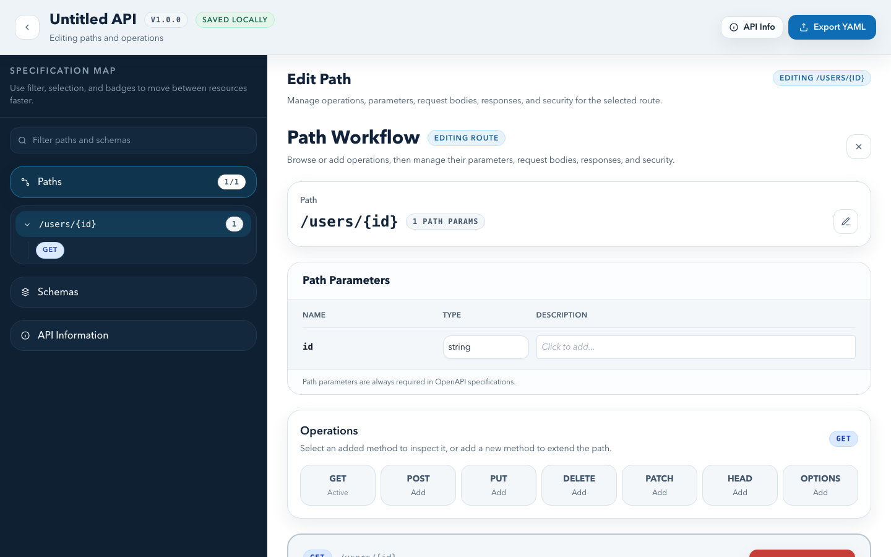

The operation editor shows, for the active operation:

- **Operation context** (HTTP method + path) at the top.
- **Query parameters** section.
- **Request body** section (only for body-eligible methods, see below).
- **Responses** section.
- **Security** section.
- A **Delete Operation** action.

You can switch between operations on the same path simply by clicking another method button.

## 9. Query parameters

Inside an operation, the **Query parameters** section uses a tree-based editor. You can add scalar, object, or array parameters and edit them in a side modal.

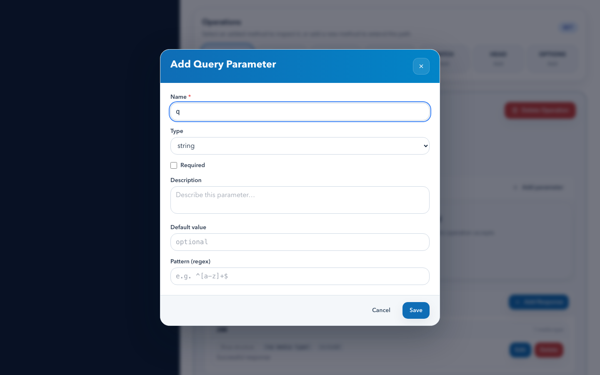

Available parameter shapes:

- **Scalar** (`string`, `number`, `integer`, `boolean`) with optional default value, regex pattern, and `minimum`/`maximum`.
- **Object** with nested properties (rendered as expandable tree nodes).
- **Array** with a chosen element type (`string`, `number`, `integer`, `boolean`, or `object` with nested properties).

After saving, parameters appear in the tree with name, type, and a `required` indicator where applicable.

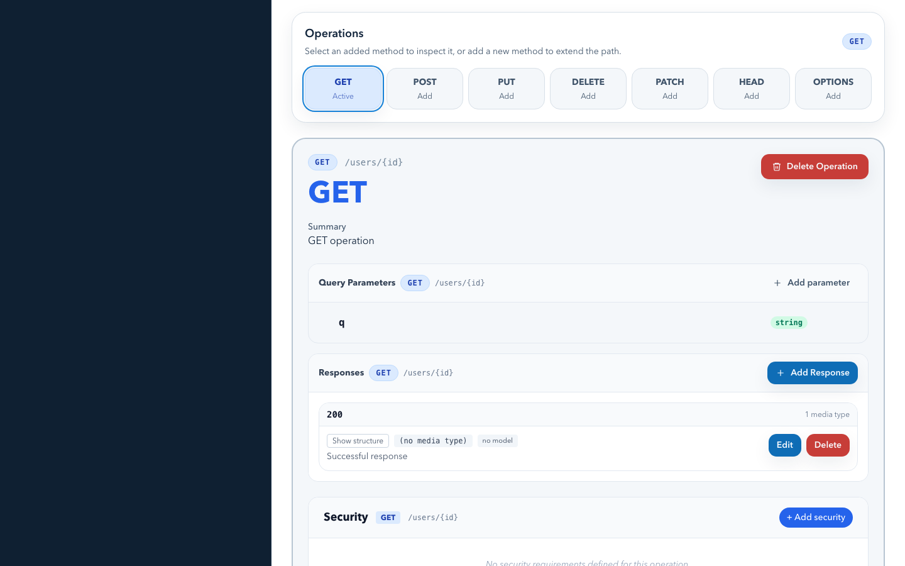

Every change is autosaved and is exported under the operation's `parameters` array as a valid OpenAPI Parameter Object.

## 10. Request body

The **Request body** section is only available for **PUT**, **POST**, and **PATCH** operations. For other methods (GET, DELETE, HEAD, OPTIONS) the section is hidden.

You configure:

- **Description** — optional, maps to `requestBody.description`.
- **Required** — toggle, maps to `requestBody.required` (defaults to `false`).
- **Media type** — pick from common types (`application/json`, `application/x-www-form-urlencoded`, `multipart/form-data`, `text/plain`, `application/octet-stream`) or type a custom value.
- **Body schema** — managed with the same tree-based editor used for query parameters, supporting scalar, object, and array fields.

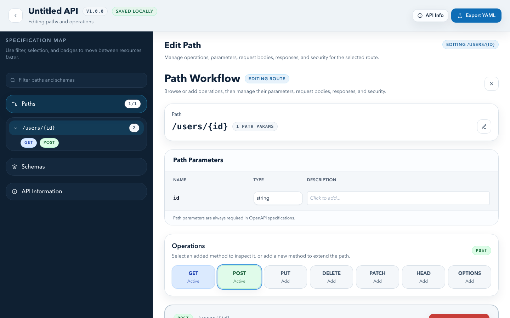

For object-typed body fields you can choose between **Define inline** (default) and **Use schema reference ($ref)** — the latter shows a (searchable) dropdown of schemas defined under `components.schemas`.

You can also **Create reusable schema from inline model** to extract the current inline body structure into a new entry under `components.schemas`. The action prompts for a target name and validates uniqueness.

## 11. Responses

The **Responses** section is available for every operation. You can declare multiple status codes and multiple media types per status code.

### Add a response

Click **Add Response** and provide:

- **Status code** — for example `200`, `201`, `400`, `404`, `500`, or `default`.
- **Description** — short summary of the response.
- **Media type** — for example `application/json`.
- **Model source** — either **Inline schema** (using the same tree editor as the request body) or **Schema reference** (pick from `components.schemas`).

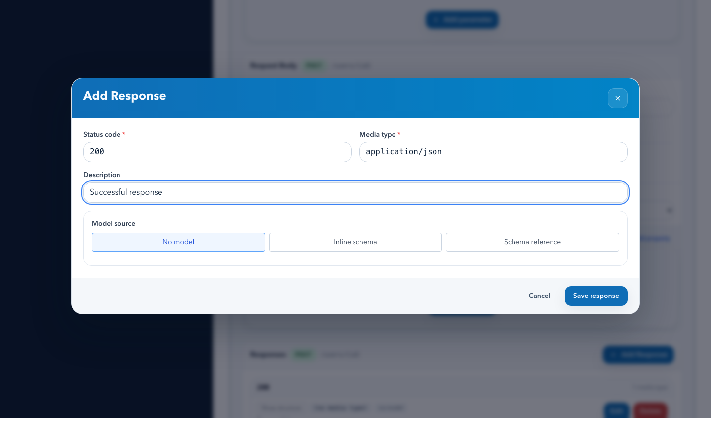

After saving, responses are listed grouped by status code; each row supports expand/collapse to preview the schema, plus inline edit and delete actions.

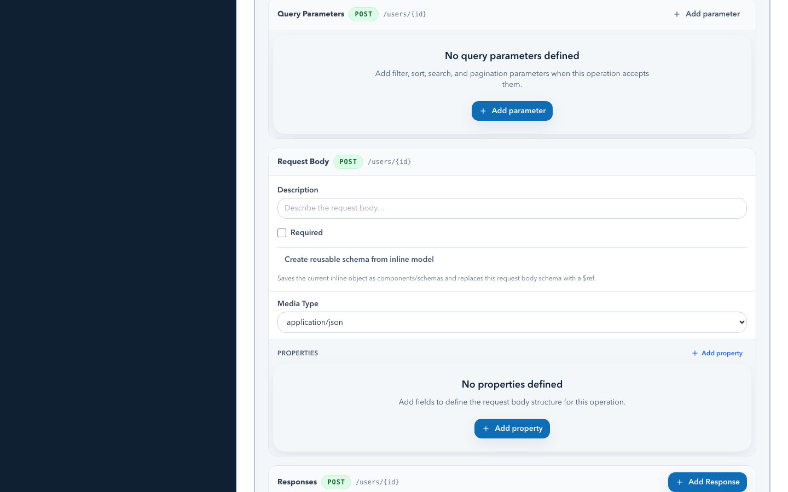

Notes on response behavior:

- Adding a second media type under the same status code does not overwrite existing media types.
- Deleting a single response row removes only that (status code + media type) entry; the status code is removed only when its last media type is removed.
- A schema reference shown in a response is clickable and jumps directly to the schema's edit form.
- You can also **create a reusable schema from an inline response structure** with a name prompt and uniqueness validation.

## 12. Security requirements

Each operation has its own **Security** section. Supported scheme types are:

- **`apiKey`** — pass a key in `header`, `query`, or `cookie` under a chosen parameter name (for example `X-API-Key`).
- **`http`** — `basic` or `bearer` scheme (with optional bearer format, e.g. `JWT`).

Click **+ Add security** to open the form:

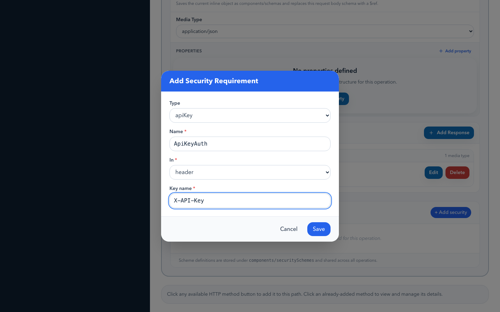

After saving, requirements appear in a list with inline edit and delete actions:

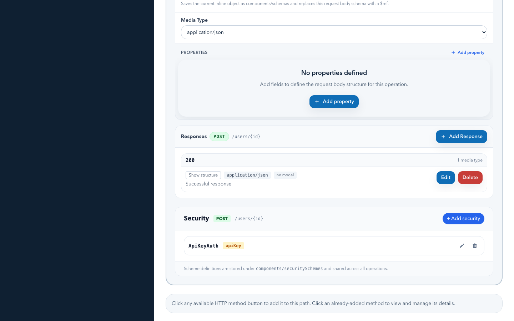

When you save a security requirement, both the per-operation `security` array and the matching entry under `components.securitySchemes` are updated together. On export, each operation receives a `security` array using the OpenAPI Security Requirement Object format (`{ schemeName: [] }`). Operations with no requirements emit no `security` key.

## 13. Reusable schemas (`components.schemas`)

The **Schemas** sidebar section lists all reusable data models. The schemas panel provides full CRUD with validation.

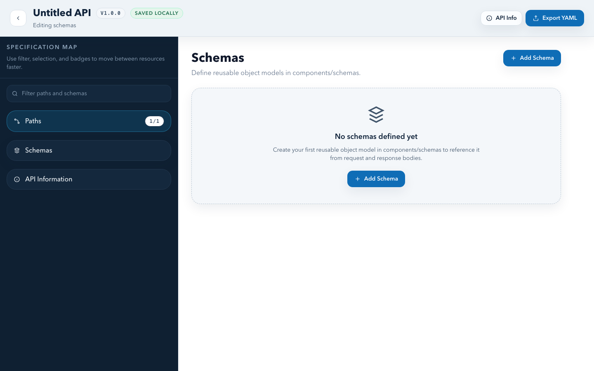

### Create a schema

Click **Add Schema**. You provide a name and edit the structure with the same tree-based editor used for request bodies and responses.

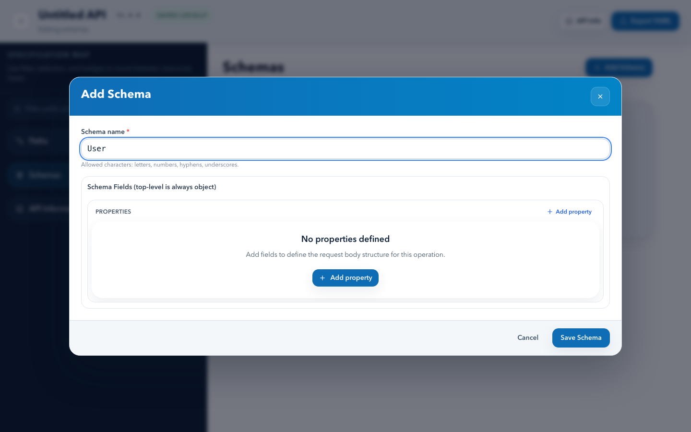

Schema names must be non-empty and contain only alphanumerics, hyphens, and underscores; duplicates are blocked with a clear error.

After saving, a confirmation message appears and the schema is added to `components.schemas`.

### Edit, rename, delete

- **Edit** — re-opens the same tree editor pre-populated with the current structure.
- **Rename** — when the name changes, a confirmation modal asks how to handle existing references:
  - **Rename all schema references to the new name**, or
  - **Create a new schema and keep existing references unchanged** (clones the current edits into a new entry; the original schema and its references are untouched).
- **Delete** — removes the schema from `components/schemas` immediately after a confirmation prompt.

### "Used in" panel

When editing an existing schema, a **Used in** section at the bottom of the form lists every operation that references this schema, including nested usages (inside arrays, object properties, and composition constructs). Use this to assess impact before renaming or deleting.

### Referencing a schema

In any object-typed field of a request body or response, switching to **Use schema reference ($ref)** shows a (searchable, when more than five) dropdown listing all schemas. Selecting a schema stores the model as `$ref: "#/components/schemas/{schemaName}"` at the right location.

## 14. Sidebar navigation, filtering and ordering

The left sidebar gives you a fast map of your specification:

- A **filter input** at the top (with a clear button) performs case-insensitive substring matching with a short debounce. It filters both **Paths** and **Schemas** simultaneously.
- A "no matches found" message appears if the filter excludes everything.
- Counts next to each section show "filtered/total" entries.
- **Paths** are listed alphabetically; clicking one expands its HTTP method badges and selects it in the editor.
- **Schemas** are listed alphabetically; clicking one opens it directly in the schema edit form.

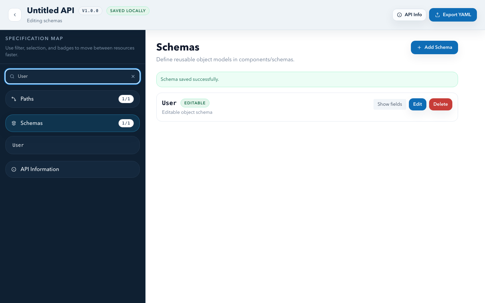

Sorting is applied consistently across every list and selector view (sidebar, schema dropdowns, response model selectors, etc.) — case-insensitive and stable for names that differ only by casing.

## 15. Autosave and persistence

Every add/edit/remove action — across paths, operations, parameters, request bodies, responses, security, and schemas — is persisted **immediately** to your browser's `localStorage`. The header badge reflects the current save state in real time:

- **Saving** — a write is in flight.
- **Saved locally** — the latest change is persisted.

When you reload the page or load a specification again from the Welcome page, the entire document is restored exactly as you left it, including:

- Path-level and operation-level definitions
- Query parameters (per operation)
- Request bodies and their inline/`$ref` schemas
- Responses (all status codes, all media types, inline or referenced models)
- Security requirements and matching `components.securitySchemes`
- All entries under `components.schemas`

Imported files are also saved into local storage on load, so they are immediately available from the **Load** modal afterwards.

## 16. Exporting your specification

Click the **Export YAML** button in the header at any time. Stop Cri Studio downloads a YAML file containing:

- The `openapi: 3.0.0` declaration and the full `info` block.
- A `paths` map containing every path, with each operation rendered under its lowercase HTTP method.
- For each operation: `parameters` (path + query), `requestBody` (only when defined and only for PUT/POST/PATCH), `responses` (with all status codes and media types), and `security` (only when at least one requirement is defined).
- A `components` block with `schemas` and `securitySchemes`.

The export preserves all field names, types, required arrays, descriptions, and nesting levels exactly as defined in the editor, producing a specification ready to be consumed by any OpenAPI-compatible tooling without manual fixes.

---

For a feature-by-feature mapping to user stories and acceptance criteria, see [FUNCTIONAL_DOCUMENTATION.md](FUNCTIONAL_DOCUMENTATION.md) and the individual files under [UserStories/](UserStories/).
