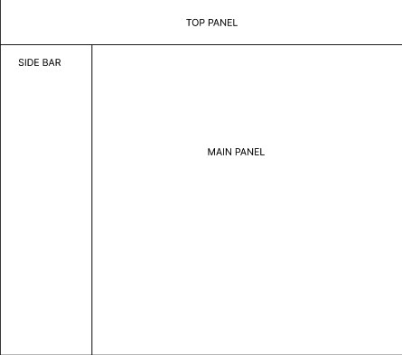
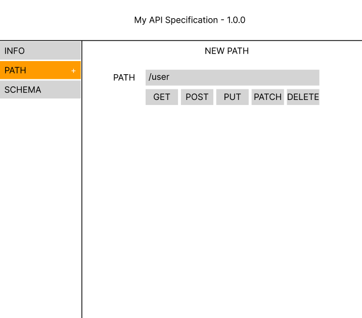
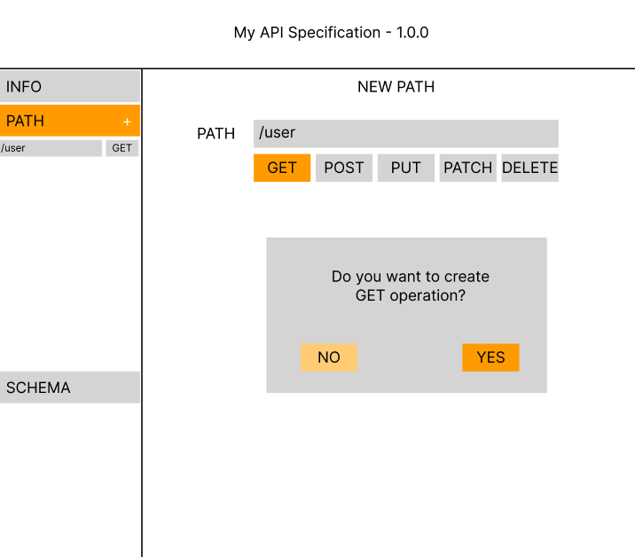
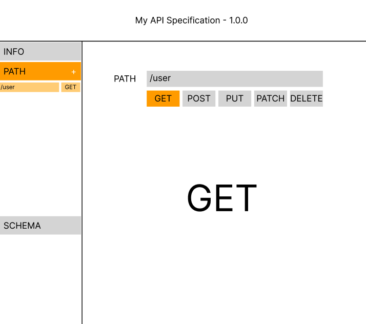
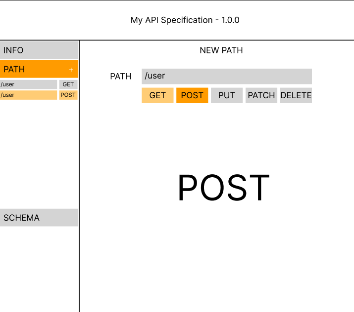

# WP-003: User defines API paths and operations

- **ID**: WP-003
- **Description**: As a technical user, I want to add API paths to my specification and define operations (GET, POST, PUT, DELETE, etc.) for each path, so I can document all available endpoints in my API.
- **Acceptance criteria**:
  - User can click "Add Path" button in sidebar to create a new path
  - New Path form appears in main panel with path name input field
  - Form displays with path name placeholder (e.g., "/users", "/products/{id}")
  - User can define HTTP operations for path by clicking method buttons (GET, POST, PUT, DELETE, PATCH, etc.)
  - Clicking a method button opens a modal dialog for operation details
  - Operation modal allows user to confirm and create the operation
  - Created operations are immediately displayed below path name in form
  - Operations display with a default background color (light gray)
  - When user selects an operation, it highlights with a different color (e.g., blue)
  - Other existing operations show default color when a different one is selected
  - Clicking an operation displays its details in a large text area with operation name
  - Path operations persist to local storage automatically
  - Defined paths appear in the sidebar Paths accordion as a list
  - Each path item in sidebar shows expandable list of its operations
  - User can add multiple operations to same path
  - User can see all defined paths and operations in sidebar navigation

## UI Structure

*The editor interface with three-panel layout. Left sidebar shows paths and operations, header displays spec info, and main panel shows path/operation editing.*

## New Path Form

*When user clicks "Add Path", a form appears in the main panel with an input field for the path name. Below the path name field are HTTP method buttons (GET, POST, PUT, DELETE, PATCH, etc.) that users can click to add operations.*

## New Operation Modal

*Clicking an HTTP method button opens a modal dialog allowing the user to define operation details. The modal includes a form for operation configuration and a confirm button to create the operation.*

## Operation Selection - Get Selected

*When user selects an operation, it is highlighted in blue and a large text display shows the operation name and details in the main panel.*

## Operation Selection - Post Selected

*Multiple operations can exist for a path. When POST is selected, it highlights in blue while other operations (like GET) display in default color. The main panel displays POST operation details.*

## Sidebar Navigation with Paths

Paths and operations are listed in the sidebar Path accordion:
- Each path appears as a collapsible item
- Operations under each path are indented
- Currently selected operation is highlighted
- User can expand/collapse paths to manage screen space