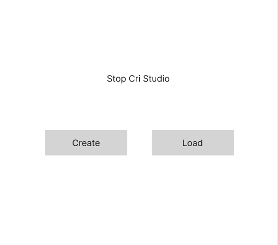

# PRD: Stop Cri Studio

## 1. Product overview

### 1.1 Document title and version

- PRD: Stop Cri Studio
- Version: 1.0
- Scope: Welcome page and initialization flows
- Last updated: March 27, 2026

### 1.2 Product summary

Stop Cri Studio is a frontend-only web application designed for technical users to create, edit, and manage OpenAPI specifications (versions 3.0 and 3.1). The application provides an intuitive interface for working with API documentation, with data persistence through browser local storage and export capabilities.

The Welcome page serves as the entry point to the application, allowing users to either create a new OpenAPI specification from scratch or load an existing specification that they've previously worked on. This is the foundational screen that sets the tone for the user experience and directs users to their intended workflow.

## 2. Goals

### 2.1 Business goals

- Provide technical users with a lightweight, accessible OpenAPI editing solution
- Enable offline-first specification management through local storage
- Allow users to export completed specifications for use in other systems
- Build a foundation for future feature expansion (editing, validation, testing)

### 2.2 User goals

- Quickly start working on new API specifications
- Access previously saved specifications without complex setup
- Maintain control over their specification data through local storage
- Export complete specifications in standard OpenAPI format

### 2.3 Non-goals

- Cloud synchronization or multi-user collaboration (for Welcome page)
- Real-time API testing or deployment
- User authentication or account management (phase 1)
- Integration with external API management platforms (future consideration)

## 3. User personas

### 3.1 Key user types

- API developers and architects
- Backend engineers documenting APIs
- Technical product managers
- Integration specialists

### 3.2 Basic persona details

- **Backend Developer**: Technical user with 3+ years of API experience, needs to quickly document and iterate on API specifications. Works primarily in their browser and prefers offline-first tools.
- **API Architect**: Senior technical user designing API standards for teams, requires clean interface for specification management and easy export for team distribution.

### 3.3 Role-based access

- **End User**: Full read/write access to personally created specifications stored in local storage only (no role restrictions at this stage)

## 4. Functional requirements

### 4.1 Welcome page display (Priority: Critical)

- Application displays a clean welcome screen on initial load
- Welcome screen includes application branding/title
- Two primary action buttons are prominently displayed
- Responsive design works on desktop and tablet devices

### 4.2 Create new specification (Priority: Critical)

- "Create" button initiates workflow for creating new OpenAPI specification
- User is prompted to select OpenAPI version (3.0 or 3.1)
- New specification is initialized with minimal required fields
- User is directed to editing interface (feature scope: future phase)

### 4.3 Load existing specification (Priority: Critical)

- "Load" button displays list of previously saved specifications from local storage
- Each specification shows metadata: name, version, last modified date
- User can select a specification to continue editing
- User can delete outdated specifications
- Import functionality allows users to load previously exported specification files

### 4.4 Local storage management (Priority: High)

- Specifications are persisted to browser local storage
- Storage quota warnings are displayed if nearing browser limits
- Export functionality allows users to download specifications as JSON files

### 4.5 Autosave functionality (Priority: High)

- All specification changes are automatically saved to local storage
- No manual save button is required
- Changes are persisted immediately as user edits
- Users do not need to worry about losing work due to accidental page closure
- Autosave operates silently without disrupting user workflow

## 5. User experience

### 5.1 Entry points & first-time user flow

- User navigates to application URL
- Application loads and displays Welcome page
- No prior loading or setup required
- First-time users see welcome messaging and two clear options

### 5.2 Core experience

**Initial page load**: The Welcome page immediately displays with clear hierarchy and visual prominence for the two main actions. The application title "Stop Cri Studio" is positioned at the top for brand recognition.

**Decision point**: Two equally prominent buttons (Create and Load) allow users to quickly choose their path without friction. Button layout is intuitive and follows standard UI patterns.

**Feedback on empty state**: For first-time users, the Load button intelligently indicates that no specifications exist yet, guiding them toward the Create workflow.

### 5.3 Advanced features & edge cases

- Handling local storage quota exceeded errors gracefully
- Clearing browser storage should not crash the application
- Browser back button behavior should return to Welcome page
- Work-in-progress warnings if user attempts to leave without saving
- Support for direct specification file import on Welcome page

### 5.4 UI/UX highlights

- Wireframe reference: [See Welcome page wireframe](#wireframe)
- Clean, minimalist design focusing on the two primary actions
- Clear visual hierarchy with application title, welcome text, and action buttons
- Accessible button sizing (minimum 48x48px for touch) with adequate spacing
- Visual feedback on button hover/click states
- Clear labeling: "Create" for new specs, "Load" for existing specs

## 6. Wireframe

*The Welcome page displays the application title at the top with two primary action buttons: "Create" (for new specifications) and "Load" (for existing specifications). The layout is clean and spacious, optimized for both desktop and tablet experiences.*

## 7. Narrative

When a technical user first opens Stop Cri Studio, they're greeted with a welcoming, uncluttered interface that immediately communicates the application's purpose. The Welcome page reduces cognitive load by presenting only two essential options: either start fresh with a new OpenAPI specification or continue working on a previously saved one. This straightforward entry point respects the user's time and technical expertise, providing a frictionless starting point for their API documentation work. Whether creating from scratch or returning to existing work, users feel they're in immediate control of their specifications, which are safely stored locally and ready to be exported whenever needed.

## 8. Success metrics

### 8.1 User-centric metrics

- Time to first action: User completes Create or Load action within 10 seconds of page load
- Successful specification loading: 100% of previously saved specifications load without errors
- User preference: Future surveys will measure user satisfaction with Welcome page UX

### 8.2 Business metrics

- Application load time: Page loads within 2 seconds on 4G connections
- Specification retention: Specifications persist across browser sessions
- Export success rate: 100% of exported specifications are valid JSON

### 8.3 Technical metrics

- Local storage utilization: Track average bytes per specification
- Browser compatibility: Functional on all modern browsers (Chrome, Firefox, Safari, Edge)
- Error handling: Zero unhandled exceptions on Welcome page

## 9. Technical considerations

### 9.1 Integration points

- Browser local storage API for persistent data storage
- File API for specification export and import
- Future: Connection to editing interface (not included in Welcome page scope)

### 9.2 Data storage & privacy

- All specification data stored exclusively in browser local storage
- No server-side storage or transmission
- No collection of user analytics or personal information
- User owns all specification data; local storage can be cleared by user at any time
- Clear privacy messaging: specifications are stored locally and never sent to external servers

### 9.3 Scalability & performance

- Local storage has browser-dependent limits (typically 5-10MB per origin)
- Application should warn users approaching storage limits
- Initial page load should be optimized (minimal JavaScript, critical CSS)
- Lazy loading of specification lists to handle potentially large numbers of saved specs

### 9.4 Potential challenges

- Browser local storage quota exceeded: Implement graceful error handling and user messaging
- Browser private/incognito mode: Specifications in private mode are cleared on browser close
- Cross-browser compatibility: Test thoroughly on all target browsers
- Mobile responsiveness: Ensure buttons and text are optimized for touch interaction
- History/Undo: Not applicable to Welcome page, but should be considered for future phases

## 10. User stories

User stories are documented separately in the [UserStories/](./UserStories/) folder:

- [WP-001: First-time user sees Welcome page](./UserStories/WP-001.md)
- [WP-002: User creates new OpenAPI specification](./UserStories/WP-002.md)
- [WP-003: User loads existing specification](./UserStories/WP-003.md)
- [WP-009: Welcome page displays correctly on desktop](./UserStories/WP-009.md)
- [WP-010: Application provides visual feedback for user interactions](./UserStories/WP-010.md)
